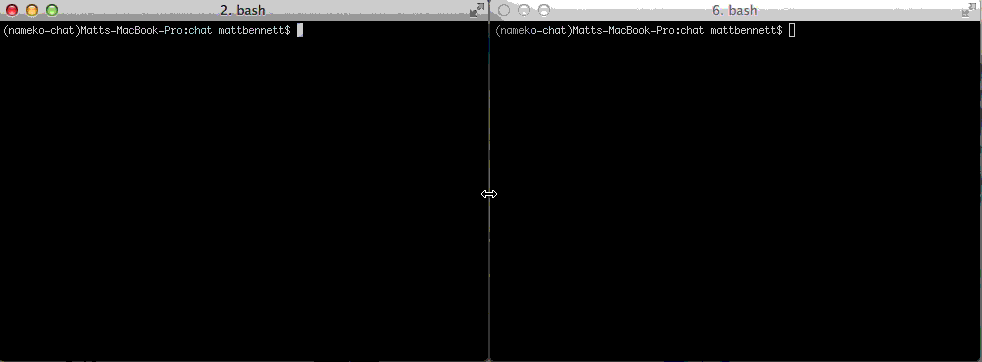

nameko-chat
===========

nameko-chat is a serverless console chat application built with `nameko <http://nameko.readthedocs.org>`_. It's designed as a reference project to illustrate how to build nameko applications.

The only central component required is a `RabbitMQ <http://rabbitmq.com/>`_ broker. To run the application, type ``python service.py``:

Getting Started
---------------

nameko-chat comprises a single `service` with three `entrypoints` and three `injections`. This tutorial will discuss how these components interact to make a functioning nameko application.

We'll discuss the process of running a nameko application (its `lifecycles`) and each of the entrypoints and injections (collectivly "dependencies") in turn, and then bring them all together in a service.

.. sidebar:: Entrypoints & Injections

    Nameko is strongly orientated around Dependency Injection. Entrypoints and Injections are both types of dependencies.

    * Entrypoints are the hooks that trigger some work inside a service.
    * Injections are the mechanisms by which a service writes state.

nameko-chat uses three entrypoints and three injections. Before we go any further let's briefly describe them.

Entrypoints:
    * `stdin`: Reads lines from ``sys.stdin`` and calls a service method with each line.
    * `once`: Calls a service method exactly once, when the application starts.
    * `handle_event`: Calls a service method every time a certain event is received from the AMQP broker.

Injections:
    * `stdout`: Allows the service to write to ``sys.stdout``
    * `user`: Stores the current user's name
    * `event_dispatcher`: Allows the service to dispatch events to other services.

The interaction of the dependencies within the service should be fairly obvious. `stdin` and `stdout` let the service read from and write to the console; `handle_event` and the `event_dispatcher` let the service  communicate with other services. `once` is used to request inital information from the user, and the `user` injection is where that information gets stored between calls.

Service and Worker Lifecycles
-----------------------------

It's important to understand the concept of `lifecycles` in nameko services before you start to write one. Let's step through the creation and use of an example service to explain this.

The following is a very simple service that echoes anything written to ``sys.stdin``::

    class Service(object):

        stdout = stdout()

        @stdin
        def handle(self, line):
            self.stdout.write(line + "\n")

At service declaration time, its ``stdout`` attribute is an instance of :class:`nameko.dependencies.DependencyFactory`, and its ``handle`` method is unchanged:

    >>> Service.stdout
    <nameko.dependencies.DependencyFactory object at 0x1085b0ed0>
    >>> Service.handle
    <unbound method Service.handle>

When a service is hosted by nameko, it enters the "service lifecycle". The service lifecycle is controlled by the :class:`nameko.containers.ServiceContainer`, and every service class is managed by a separate container instance.

The container has several states that correspond to the "service lifecycle":

    * initialise:

        The service class is inspected and its dependencies discovered. Every :class:`nameko.dependencies.DependencyFactory` is called to produce an instance of the dependency's provider class.

        The :attr:`nameko.containers.ServiceContainer.dependencies` attribute of an initialised container hosting the service above would contain an instance of :class:`Stdout` and an instance of :class:`Stdin`::

            >>> container.dependencies
            DependencySet([<dependencies.stdin.StdinProvider object at 0x1085efa90>, <depend
            encies.stdout.StdoutProvider object at 0x1085efa50>])

    * prepare:

        Before a service is hosted, its dependency instances are given the chance to `prepare` for running, by declaring a :meth:`prepare` `lifecycle method`. None of the dependencies in nameko-chat require this lifecycle state.

    * start:

        :meth:`start` is called when a service starts being hosted. Dependency provider classes should implement a :meth:`start` `lifecycle method` to do anything required to start processing their external stimili.

    * stop:

        :meth:`stop` is called when a service stops being hosted. Similarly, dependency provider classes may implement a :meth:`stop` method to hook into this lifecycle phase.

While a service is being hosted, an entrypoint will "fire", triggering a method call within the service. This kicks off the "worker lifecycle":

    * instantiate:

        When an entrypoint "fires", the :class:`~nameko.containers.ServiceContainer` creates a new instance of the service class.

    * acquire injection:

        Any injection provider dependencies on the service instance are replaced by the result of the :meth:`acquire_injection` method on that injection.

    * worker setup:

        All dependencies are notified that a worker is about to commence.

    * worker execution:

        The entrypoint decorated method on the service instance is executed. This may involve calls to injections on the service instance.

    * worker result:

        All injection dependencies are notified of the result of the worker execution, including any exception that was raised. This is useful for post-processing worker results, for example keeping a log.

    * worker teardown:

        All dependencies are notified that a worker has completed its execution. This is used to remove any per-worker state in the dependency provider.

    * destroy worker:

        The service instance has just executed is now destroyed. That means you can't store state on ``self`` inside a service method - you have to use an injection to maintain state between calls.

Decomposing the Dependencies
----------------------------

Let's look at each of the dependencies in turn. Each implementation is made up of a `provider class` and an ``@entrypoint`` or ``@injection`` decorated function, which must return a :class:`DependencyFactory` for the approriate provider class.

`@stdin` entrypoint
___________________

The `stdin` entrypoint reads from ``sys.stdin`` and passes each line to a service method. Example usage::

  class Service(object):

    @stdin
    def handle_stdin(self, line):
        print line  # echo whatever was read from stdin

Here's the full implementation of the dependency:

.. literalinclude:: ../chat/dependencies/stdin.py

Going through the methods on the provider class in a logical order:

.. literalinclude:: ../chat/dependencies/stdin.py
   :pyobject: StdinProvider.start

:meth:`start` is one of the provider `lifecycle methods`. It is called on all of a service's dependencies when the container hosting that service starts. The :class:`StdinProvider` simply asks the container to spawn a managed thread to run its :meth:`_run` method.

.. literalinclude:: ../chat/dependencies/stdin.py
   :pyobject: StdinProvider.stop

:meth:`stop` is also `lifecycle method`. All we do here is kill the greenthread we asked the container to spawn for us in :meth:`stop`.

.. literalinclude:: ../chat/dependencies/stdin.py
   :pyobject: StdinProvider.__init__

Calls to ``sys.stdin`` are blocking, and therefore incompatible with eventlet. The :class:`eventlet.tpool.Proxy` class is a utility that wraps blocking calls so that you can wait on them in eventlet without stalling the event loop. We create the ``Proxy`` in :meth:`StdinProvider.__init__` and stash it for use later.

.. literalinclude:: ../chat/dependencies/stdin.py
   :pyobject: StdinProvider._run

This is the workhorse method of the :class:`StdinProvider`, and implements the process of then entrypoint "firing" - receiving something from ``sys.stdin`` and spawning a new worker to handle it.

It perpetually waits for a line to be read from the `stdin` proxy, generates appropriate ``args`` and ``kwargs`` for its associated service method and finally creates asks the ``container`` to spawn a new worker to run it. Note that :meth:`StdinProvider._run` executes in a separate greenthread (spawned during :meth:`StdinProvider.start`).

:meth:`nameko.containers.ServiceContainer.spawn_worker` will throw a :class:`nameko.exceptions.ContainerBeingKilled` exception if it is in the process of tearing down when the entrypoint fires. Some dependencies may take some action (e.g. rejecting a message) in this situation, but in this case there is nothing to do.

.. literalinclude:: ../chat/dependencies/stdin.py
   :pyobject: stdin

Finally, we make a method that retuns a :class:`nameko.dependencies.DependencyFactory` for our provider class and decorate it with the :func:`nameko.dependencies.entrypoint` decorator, which registers it as an entrypoint dependency.

`@once` entrypoint
__________________

The `once` entrypoint fires the decorated service method once, as soon as the service starts. Example usage::

  class Service(object):

    @once("matt")
    @once("robot")
    def say_hello(self, name):
        print "hello ", name

The above snippet will print::

    hello robot
    hello matt

as soon as the service starts.

The `once` entrypoint is the simplest entrypoint possible:

.. literalinclude:: ../chat/dependencies/once.py

:meth:`OnceProvider.__init__` receives any arguments passed to the :class:`~nameko.dependencies.DependencyFactory`. During the :meth:`OnceProvider.start` lifecycle method, it spawns a worker to execute its associated method and passes the arguments along.

`user` injection
________________

The `user` injection allows the service to store the current username. It also exposes methods to "login" a user and check whether a user is already logged in.

.. literalinclude:: ../chat/dependencies/user.py

The return value of :meth:`UserProvider.acquire_injection` is what's made available to running services. The `UserState` object is instantiated once and injected into all subsequent workers, thus providing persistent state.

`stdout` injection
__________________

The `stdout` injection exposes ``sys.stdout``:

.. literalinclude:: ../chat/dependencies/stdout.py

``sys.stdout`` is a global, so we don't *need* to use an injection to make it available to a service, but doing so is recommended because it makes testing much easier.

:class:`StdoutProvider` also makes use of the :meth:`stop` `lifecycle method` to automatically write a newline to the console before the service stops.

`event_dispatcher` injection
____________________________

The :func:`~nameko.events.event_dispatcher` injection is built-in to nameko. It accepts an instance of an :class:`~nameko.events.Event`, serialises it and dispatches it to an exchange on the RabbitMQ broker. Any services registered to receive the event will do so via the ``event_handler`` entrypoint.

`@event_handler` entrypoint
___________________________

The :func:`~nameko.events.event_handler` entrypoint is also built-in to nameko.
Using normal `messaging paradigms <https://www.rabbitmq.com/getstarted.html>`_ a service can subsribe to events from other services (or itself) of a certain ``type``.

Writing the Chat Service
------------------------

The logic of the chat service is quite simple:

* On first start, it should ask for a username (and read it from stdin)
* Any subsequent lines read from stdin should be sent as messages
* The message should include the username of the person that wrote it
* Messages sent from other clients should be printed to the console (but only if a username has already been entered)

Before we write any logic though, let's create a stub service that just includes the dependencies we've already discussed::

    class Chat(object):

        # three injections

        dispatch = event_dispatcher()
        stdout = stdout()
        user = user()

        # three entrypoints

        @once
        def login(self):
            pass

        @stdin
        def handle_stdin(self, line):
            pass

        @event_handler('chat', 'message',
                       handler_type=BROADCAST, reliable_delivery=False):
        def handle_message(self, event_data):
            pass

The ``event_handler`` configuration specifies that the service should listen to ``message`` events from the ``chat`` service (if the service class doesn't have a ``name`` attribute it defaults to the lowercase class name). In addition it specifies that it's a "broadcast" type handler, which means that every instance of the service should receive all events. Broadcast handlers are incompatible with reliable delivery of events, so we disable that too.

Now let's create the :class:`~nameko.events.Event` that we'll use to send an receive messages:

.. literalinclude:: ../chat/service.py
    :pyobject: Message

The two important attributes are ``type``, which handlers must specify to listen to these events, and ``data``, which describes the information that is serialised when the event is dispatched.

Finally, let's fill in the business logic of the chat service.

There are a couple of helper functions:

.. literalinclude:: ../chat/service.py
   :pyobject: Chat.send_message

.. literalinclude:: ../chat/service.py
   :pyobject: Chat.prompt

And then a tiny bit of logic in each entrypoint:

.. literalinclude:: ../chat/service.py
   :lines: 44-47

.. literalinclude:: ../chat/service.py
   :lines: 49-57

.. literalinclude:: ../chat/service.py
   :lines: 59-69

That's it! You've finished implementing nameko-chat.

Indices and tables
==================

* :ref:`genindex`
* :ref:`modindex`
* :ref:`search`

